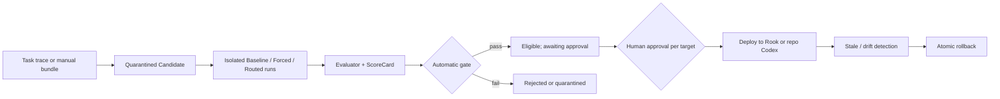

<p align="center">
  
</p>

<h1 align="center">Rook</h1>

<p align="center">
  <strong>A local Python coding agent with Rook Forge Skill exams, approval, deployment, and rollback.</strong>
</p>

<p align="center">
  <a href="#quickstart"></a>
  <a href="#tui"></a>
  <a href="#configuration"></a>
  <a href="#development"></a>
</p>

<p align="center">
  English
  · <a href="README.zh-CN.md">简体中文</a>
</p>

---

Rook is a real, runnable local Python coding agent. **Rook Forge** is its built-in Skill governance control plane: generated or manually authored Skills are examined with isolated paired experiments, held behind automatic safety gates, explicitly approved by a human, deployed independently to Rook or the current Codex repository, and rolled back through an immutable audit trail. The implementation package remains `rook_agent.evalops`.

If you want to understand how coding agents actually work, Rook keeps the moving parts visible instead of hiding them behind a black box.

- Evaluate whether a Skill improves an Agent before it can be approved or deployed.
- Learn the agent loop, tool calling, permissions, sessions, and context handling.
- Build on a small Python codebase with clear module boundaries.
- Use a local coding agent while still being able to inspect how it works.


## Rook Forge

Rook treats a Skill as a versioned change that must pass an exam and a release review. Manual bundles and trace-derived output enter an inactive quarantine, then run through isolated Baseline/Forced and Baseline/Routed pairs. Deterministic evaluators produce ScoreCards; safety, regression, sample-size, and effect gates decide eligibility independently for each Agent target. A passing gate remains inactive until an explicit, auditable `rook skill approve` deploys it.



The version-controlled evidence protocol contains a 12-case development/Pilot
suite and a sealed, disjoint 12-case Formal holdout across service catalog,
application, package, deployment, operations, and ML-service repository shapes.
The Formal manifest locks the Candidate content hash and fails before any model
call if the Candidate changes. Fake Agent controls prove the control plane only.

After the native Windows sandbox fix, an authorized `gpt-5.4-mini` Pilot
completed 24/24 calls with 12 comparable pairs, zero infrastructure exclusions,
100% trace completeness, and zero new regressions. It observed Baseline 25% vs
Forced Skill 100% (+75pp), 22.7% lower median latency, and 12.9% lower median
Token use. The immutable run accidentally used the Formal sample threshold and
was quarantined; the dedicated Pilot policy now fixes that boundary. These are
Pilot measurements, not the pending 72-call Formal resume result.

Run the complete zero-cost lifecycle from Candidate creation through dual-target rollback with one command:

```sh
rook eval demo
```

The command uses deterministic Fake Agents only and writes its isolated Registry, reports, Rook deployment, and repository-level Codex deployment below `.rook/forge-demo/run-*`. It never probes or launches Codex and makes no model or network call.

- [EvalOps usage](docs/EVALOPS.md)
- [Offline demo walkthrough](docs/DEMO.md)
- [Portfolio evidence and claim boundary](docs/PORTFOLIO_EVIDENCE.md)
- [Dogfooding and incident ledger](docs/DOGFOODING.md)
- [Redacted Pilot evidence](docs/evidence/rm2-pilot-summary.json)

## Why Rook

Most coding-agent demos show the surface: a prompt goes in, code changes come out. Rook focuses on the machinery in between.

Compared with larger projects like OpenCode, Rook is intentionally smaller in scope.

| Dimension | Rook | Larger projects like OpenCode |
| --- | --- | --- |
| Primary goal | Make agent internals readable and teachable | Deliver a broader production-style coding-agent platform |
| Codebase shape | Roughly 32k lines of Python runtime code in this repo | Roughly 575k lines of TS/JS across a much larger multi-surface codebase |
| Engineering tradeoff | Drops some extra platform surface area to stay inspectable | Accepts more complexity to support a broader product surface |
| Best fit | Learning, modification, interview prep, portfolio projects, and local experimentation | Users who want a larger, more full-surface coding-agent environment |

The goal is not to out-feature a bigger coding agent. The goal is to keep the system real enough to use, but small enough that you can still read it end to end and understand why each subsystem exists.

That also makes Rook a practical repo to study deeply, adapt for your own workflow, and turn into a resume-worthy or portfolio-friendly project after you have extended it.

Compared with more tutorial-first or lightweight learning repos, Rook also tries to stay closer to a small but testable engineering system.

| Dimension | Rook | Many learning-oriented agent repos |
| --- | --- | --- |
| Learning value | Readable subsystem boundaries and explicit docs | Often optimized for a single tutorial path or demo flow |
| Practical surface | Real TUI, tools, permissions, sessions, provider adapters | Often focused on a narrower loop or a simpler proof of concept |
| Verification | 120+ test files, cross-platform offline CI, and multiple benchmark entry points | Often lighter on testing and benchmark integration |
| Extension path | Easier to adapt into a portfolio or resume project | Often better for following along than for long-term extension |

In this repo, the learning goal is important, but it is paired with enough runtime structure, tests, and benchmark hooks to make the project useful after the first read-through.

It is built for people who want to:

- study how a coding agent is assembled
- modify or extend a local Python implementation
- understand the architecture well enough to explain it in an interview

Detailed subsystem design lives in the docs, not in this README.

## Quickstart

Install the tagged GitHub release with `pipx`:

```sh
pipx install "git+https://github.com/ZHUMUJUN/Rook.git@v0.2.1"
```

Or install from a local clone:

```sh
pipx install .
```

Start the TUI:

```sh
rook
```

Run one message without opening the TUI:

```sh
rook --message "Summarize this repository in one paragraph"
```

Use line-oriented interactive mode:

```sh
rook --interactive
```

Try Rook Forge without configuring a provider or spending model tokens:

```sh
rook eval demo
```

## What You Get

- Local Python coding agent
- Textual TUI that exposes agent activity instead of hiding it
- Tool calling with permission checks before risky actions
- Session persistence, resume flow, and context compaction
- Skills, provider adapters, and clean modules for study and modification
- Rook Forge Skill quarantine, isolated A/B exams, ScoreCards, human approval, target-specific deployment, and rollback

## Configuration

Create a starter config:

```sh
rook config init
rook config path
rook config show
```

Keep secrets in environment variables:

```sh
export ROOK_API_KEY="your-api-key"
```

Default config locations:

```text
global:  ~/.config/rook/config.toml
project: ./rook.toml
```

Provider support is centered on the OpenAI Chat Completions-compatible path. The OpenAI-compatible 流式 adapter is the mainline streaming implementation and normalizes provider errors such as PROMPT_TOO_LONG. The Anthropic provider is still 实验性 and does not yet expose Anthropic 原生 thinking/cache/streaming. Rook does not use the OpenAI Responses API yet, so native reasoning and 多模态 support are future provider work rather than current runtime behavior.

## TUI

Rook's TUI is designed to expose the agent loop instead of hiding it. You can see session state, streamed assistant output, tool calls, tool results, and permission prompts in one place.

Ready state:


Conversation flow:


## Documentation

- [Technical Docs Index](docs/README.md)
- [Chinese Docs Index](docs/README.zh-CN.md)
- [Codebase Reading Guide](docs/CODEBASE_READING_GUIDE.md)
- [Codex-only Skill EvalOps](docs/EVALOPS.md)
- [Offline Rook Forge Demo](docs/DEMO.md)
- [Portfolio Evidence](docs/PORTFOLIO_EVIDENCE.md)

## Development

Install dev dependencies:

```sh
python -m venv .venv
.venv/bin/python -m pip install -e ".[dev]"
```

Run all tests:

```sh
.venv/bin/python -m pytest
```

Run a focused test file:

```sh
.venv/bin/python -m pytest tests/test_app_tui.py -q
```

## Philosophy

Rook was built to answer a question most coding agents do not address:

> What actually happens inside when an agent streams, calls tools, asks for
> permission, compacts context, and resumes a session?

It is a real runnable agent, but it is also a readable Python project you can learn from one subsystem at a time.
