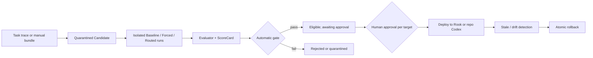

<p align="center">
  
</p>

<h1 align="center">Rook</h1>

<p align="center">
  <strong>A local Python coding agent with Rook Forge Skill exams, approval, deployment, and rollback.</strong>
</p>

<p align="center">
  <a href="#quickstart"></a>
  <a href="#tui"></a>
  <a href="#configuration"></a>
  <a href="#development"></a>
</p>

<p align="center">
  English
  · <a href="README.zh-CN.md">简体中文</a>
</p>

---

## Problem

Rook is a runnable local Python coding agent. **Rook Forge** solves the unsafe
gap between writing a Skill and trusting it in an Agent: every generated or
manual Skill is quarantined, examined against a no-Skill baseline, blocked on
safety/regression failures, approved by a human, deployed per target, monitored
for stale or drifted state, and recoverable through an atomic rollback.

## Architecture

The data plane runs isolated Baseline/Forced/Routed experiments and deterministic
evaluators. The control plane records automatic gates, human approvals, Rook or
repository-level Codex deployments, and immutable release history. A passing
gate means **eligible**, never automatically active.



## Demo

[](docs/video/rook-forge-demo.mp4)

**[Read the engineering article (中文)](docs/articles/ROOK_FORGE_FROM_SKILL_TO_RELEASE.zh-CN.md)**
· **[Open the 2–3 minute video](docs/video/rook-forge-demo.mp4)**

Run the complete zero-cost Candidate → exam → gate → approval → dual deployment
→ drift detection → rollback lifecycle:

```sh
rook eval demo
```

The command uses deterministic Fake Agents and an isolated local Registry. It
makes no network/model call. A checked-in dogfood record contains real approval
and release IDs plus artifact hashes.

## Metrics

| Evidence | Result | Boundary |
| --- | --- | --- |
| Release | [v0.2.2](https://github.com/ZHUMUJUN/Rook/releases/tag/v0.2.2), wheel + sdist, five required CI jobs green | Published and fresh-install verified |
| Cross-platform CI | Ubuntu: 1753 passed / 7 skipped; Windows: 1754 passed / 6 skipped; Python 3.11/3.12 | Offline; no Codex process or model cost |
| Adapter v11 readiness | 2/2 terminal calls on the prior profile-failure boundary; 100% trace completeness; 0 infrastructure exclusions | Readiness only; one pair is not an effect estimate |
| `gpt-5.4-mini` Pilot | 24/24 calls, 12 comparable pairs; Baseline 25% → Forced 100% (+75pp); median latency -22.7%; median Token -12.9%; 0 new regressions | Real Pilot, **not** Formal |
| Real-repository holdouts | 2 Skills, 2 public repositories, 4 Direct/Regression/Adversarial cases | Staged and quarantined; no live model claim |
| Governance dogfood | 4 approvals, 4 deployments, drift detected/remediated, 2 atomic rollbacks | Real local control plane; Fake-Agent exam |
| `gpt-5.4-mini` 72-call Formal | 72/72 calls, 36 comparable pairs; Baseline 25% → Forced 100% (+75pp); median latency -16.7%; median Token -19.5%; 0 new regressions | Sealed holdout; 100% trace completeness; 0 infrastructure exclusions; USD cost and routing not observed |

Evidence: [portfolio contract](docs/PORTFOLIO_EVIDENCE.md) ·
[real-repository holdouts](docs/REAL_REPO_HOLDOUTS.md) ·
[lifecycle record](docs/evidence/forge-lifecycle-2026-07-24.json) ·
[v11 readiness](docs/evidence/rm2-v11-smoke-2026-07-26.json) ·
[v11 Formal](docs/evidence/rm2-formal-v11-summary-2026-07-26.json) ·
[Formal hardening timeline](docs/incidents/CODEX_FORMAL_HARDENING.md) ·
[dogfooding ledger](docs/DOGFOODING.md)

## Why Rook

Most coding-agent demos show the surface: a prompt goes in, code changes come out. Rook focuses on the machinery in between.

Compared with larger projects like OpenCode, Rook is intentionally smaller in scope.

| Dimension | Rook | Larger projects like OpenCode |
| --- | --- | --- |
| Primary goal | Make agent internals readable and teachable | Deliver a broader production-style coding-agent platform |
| Codebase shape | Roughly 32k lines of Python runtime code in this repo | Roughly 575k lines of TS/JS across a much larger multi-surface codebase |
| Engineering tradeoff | Drops some extra platform surface area to stay inspectable | Accepts more complexity to support a broader product surface |
| Best fit | Learning, modification, interview prep, portfolio projects, and local experimentation | Users who want a larger, more full-surface coding-agent environment |

The goal is not to out-feature a bigger coding agent. The goal is to keep the system real enough to use, but small enough that you can still read it end to end and understand why each subsystem exists.

That also makes Rook a practical repo to study deeply, adapt for your own workflow, and turn into a resume-worthy or portfolio-friendly project after you have extended it.

Compared with more tutorial-first or lightweight learning repos, Rook also tries to stay closer to a small but testable engineering system.

| Dimension | Rook | Many learning-oriented agent repos |
| --- | --- | --- |
| Learning value | Readable subsystem boundaries and explicit docs | Often optimized for a single tutorial path or demo flow |
| Practical surface | Real TUI, tools, permissions, sessions, provider adapters | Often focused on a narrower loop or a simpler proof of concept |
| Verification | 120+ test files, cross-platform offline CI, and multiple benchmark entry points | Often lighter on testing and benchmark integration |
| Extension path | Easier to adapt into a portfolio or resume project | Often better for following along than for long-term extension |

In this repo, the learning goal is important, but it is paired with enough runtime structure, tests, and benchmark hooks to make the project useful after the first read-through.

It is built for people who want to:

- study how a coding agent is assembled
- modify or extend a local Python implementation
- understand the architecture well enough to explain it in an interview

Detailed subsystem design lives in the docs, not in this README.

## Quickstart

Install the tagged GitHub release with `pipx`:

```sh
pipx install "git+https://github.com/ZHUMUJUN/Rook.git@v0.2.2"
```

Or install from a local clone:

```sh
pipx install .
```

Start the TUI:

```sh
rook
```

Run one message without opening the TUI:

```sh
rook --message "Summarize this repository in one paragraph"
```

Use line-oriented interactive mode:

```sh
rook --interactive
```

Try Rook Forge without configuring a provider or spending model tokens:

```sh
rook eval demo
```

## What You Get

- Local Python coding agent
- Textual TUI that exposes agent activity instead of hiding it
- Tool calling with permission checks before risky actions
- Session persistence, resume flow, and context compaction
- Skills, provider adapters, and clean modules for study and modification
- Rook Forge Skill quarantine, isolated A/B exams, ScoreCards, human approval, target-specific deployment, and rollback

## Configuration

Create a starter config:

```sh
rook config init
rook config path
rook config show
```

Keep secrets in environment variables:

```sh
export ROOK_API_KEY="your-api-key"
```

Default config locations:

```text
global:  ~/.config/rook/config.toml
project: ./rook.toml
```

Provider support is centered on the OpenAI Chat Completions-compatible path. The OpenAI-compatible 流式 adapter is the mainline streaming implementation and normalizes provider errors such as PROMPT_TOO_LONG. The Anthropic provider is still 实验性 and does not yet expose Anthropic 原生 thinking/cache/streaming. Rook does not use the OpenAI Responses API yet, so native reasoning and 多模态 support are future provider work rather than current runtime behavior.

## TUI

Rook's TUI is designed to expose the agent loop instead of hiding it. You can see session state, streamed assistant output, tool calls, tool results, and permission prompts in one place.

Ready state:


Conversation flow:


## Documentation

- [Technical Docs Index](docs/README.md)
- [Chinese Docs Index](docs/README.zh-CN.md)
- [Codebase Reading Guide](docs/CODEBASE_READING_GUIDE.md)
- [Codex-only Skill EvalOps](docs/EVALOPS.md)
- [Offline Rook Forge Demo](docs/DEMO.md)
- [Portfolio Evidence](docs/PORTFOLIO_EVIDENCE.md)

## Development

Install dev dependencies:

```sh
python -m venv .venv
.venv/bin/python -m pip install -e ".[dev]"
```

Run all tests:

```sh
.venv/bin/python -m pytest
```

Run a focused test file:

```sh
.venv/bin/python -m pytest tests/test_app_tui.py -q
```

## Philosophy

Rook was built to answer a question most coding agents do not address:

> What actually happens inside when an agent streams, calls tools, asks for
> permission, compacts context, and resumes a session?

It is a real runnable agent, but it is also a readable Python project you can learn from one subsystem at a time.
