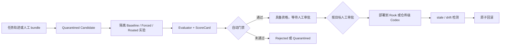

<p align="center">
  
</p>

<h1 align="center">Rook</h1>

<p align="center">
  <strong>内置 Rook Forge Skill 考试、审批、部署与回滚的本地 Python Coding Agent。</strong>
</p>

<p align="center">
  <a href="#快速开始"></a>
  <a href="#tui"></a>
  <a href="#配置"></a>
  <a href="#开发"></a>
</p>

<p align="center">
  <a href="README.md">English</a>
  · 简体中文
</p>

---

## 问题

Rook 是一个能真实运行的本地 Python Coding Agent。**Rook Forge** 解决的是
“写完 Skill”到“敢让 Agent 使用”之间的治理空白：自动生成或人工编写的
Skill 先隔离，再与无 Skill 基线做配对考试；安全或回归失败会被阻断，门禁
通过后仍需人工审批，随后按 Rook/Codex 独立部署，并支持 stale、漂移检测和
原子回滚。

## 架构

数据面执行 Baseline/Forced/Routed 隔离实验与确定性 Evaluator；控制面记录
自动门禁、人工审批、Rook/仓库级 Codex 部署和不可变发布历史。门禁通过只
代表**具备上线资格**，绝不会自动激活。



## 演示

[](docs/video/rook-forge-demo.mp4)

**[阅读技术文章：把 Skill 当成软件发布](docs/articles/ROOK_FORGE_FROM_SKILL_TO_RELEASE.zh-CN.md)**
· **[打开 2–3 分钟演示视频](docs/video/rook-forge-demo.mp4)**

一条命令运行 Candidate → 考试 → 门禁 → 审批 → 双目标部署 → 漂移检测 →
回滚的完整零成本生命周期：

```sh
rook eval demo
```

命令只使用确定性 Fake Agent 和隔离的本地 Registry，不产生网络或模型调用。
版本库中的 dogfood 记录保留了真实审批/发布 id 和制品哈希。

## 指标

| 证据 | 结果 | 边界 |
| --- | --- | --- |
| 发布 | [v0.2.3](https://github.com/ZHUMUJUN/Rook/releases/tag/v0.2.3)，wheel + sdist，5 个必需 CI job 全绿 | 已发布并做全新环境安装验证 |
| 跨平台 CI | Ubuntu：1753 passed / 7 skipped；Windows：1754 passed / 6 skipped；Python 3.11/3.12 | 离线，无 Codex 进程和模型费用 |
| Adapter v11 readiness | 在此前 profile 失败边界上 2/2 终态；轨迹完整度 100%；基础设施排除 0 | 仅证明就绪，单配对不是效果估计 |
| `gpt-5.4-mini` Pilot | 24/24 次、12 个可比配对；Baseline 25% → Forced 100%（+75pp）；时延 -22.7%；Token -12.9%；新增回归 0 | 真实 Pilot，**不是** Formal |
| 真实仓库 holdout | 2 个 Skill、2 个公开仓库、4 个 Direct/Regression/Adversarial 案例 | 已 staged/quarantined，没有 live model 结论 |
| 治理 dogfood | 4 次审批、4 次部署、漂移发现/恢复、2 次原子回滚 | 真实本地控制面；Fake Agent 考试 |
| `gpt-5.4-mini` 72-call Formal | 72/72 次、36 个可比配对；Baseline 25% → Forced 100%（+75pp）；中位时延 -16.7%；中位 Token -19.5%；新增回归 0 | sealed holdout；轨迹完整度 100%；基础设施排除 0；美元成本和路由未观测 |

证据入口：[简历证据合同](docs/PORTFOLIO_EVIDENCE.zh-CN.md) ·
[真实仓库 holdout](docs/REAL_REPO_HOLDOUTS.md) ·
[治理生命周期记录](docs/evidence/forge-lifecycle-2026-07-24.json) ·
[v11 readiness](docs/evidence/rm2-v11-smoke-2026-07-26.json) ·
[v11 Formal](docs/evidence/rm2-formal-v11-summary-2026-07-26.json) ·
[Formal 加固时间线](docs/incidents/CODEX_FORMAL_HARDENING.md) ·
[dogfooding 账本](docs/DOGFOODING.md)

## 为什么做 Rook

大多数 coding-agent 演示展示的是表面：一个 prompt 进去，代码改完出来。Rook 关注的是中间的机械结构。

和 OpenCode 这类更大的项目相比，Rook 刻意把范围收得更小。

| 维度 | Rook | OpenCode 这类更大的项目 |
| --- | --- | --- |
| 主要目标 | 把 agent 内部机制做得可读、可学、可讲清楚 | 提供更完整、更偏产品化的 coding-agent 平台 |
| 代码形态 | 当前仓库核心运行时代码约 3.2 万行 Python | TS/JS 代码规模约 57 万行，平台层和工程表面也更多 |
| 工程取舍 | 主动放弃一部分额外平台能力，换取更强可读性 | 接受更高复杂度，以支持更宽的产品能力面 |
| 更适合谁 | 学习、二次改造、面试讲解、作品集 / 简历项目、本地实验 | 更想直接使用一个大而完整的 coding-agent 环境的用户 |

目标不是在功能数量上和更大的 coding agent 正面对抗，而是把系统做得既足够真实可用，又足够小，让你还能从头到尾读懂它，并理解每个子系统为什么存在。

这也意味着 Rook 很适合被深入学习、按自己的工作流继续改造，并在做出有代表性的扩展后，作为一个能写进简历或作品集的项目来展示。

和更偏教程型、轻量参考型的学习项目相比，Rook 也尽量保持它更像一个“小而完整、可验证”的工程系统。

| 维度 | Rook | 常见学习型 agent 项目 |
| --- | --- | --- |
| 学习价值 | 子系统边界清楚，文档明确，适合按模块阅读 | 往往更偏单一路径教程或 demo 流程 |
| 实用表面 | 有真实 TUI、tools、permissions、sessions、provider adapters | 往往更聚焦某个更窄的 loop 或概念验证 |
| 可验证性 | 有 120+ 个测试文件、跨平台离线 CI，并接入多个 benchmark 入口 | 往往较少强调测试体系和 benchmark 集成 |
| 延展路径 | 更适合继续改造成作品集或简历项目 | 更适合跟做和入门，但未必适合长期扩展 |

也就是说，这个仓库在“适合学习”之外，还尽量保留了足够的运行时结构、测试和 benchmark 钩子，让它在你第一次读完之后依然有继续演化的价值。

它适合这样的人：

- 想系统理解一个 coding agent 是如何组织起来的
- 想修改或扩展一个本地 Python 实现
- 想把 agent 架构真正看懂，并能在面试或学习中讲清楚

更细的子系统说明已经放进文档，这个 README 只保留项目首页需要的信息。

## 快速开始

推荐用 `pipx` 安装已打标签的 GitHub release：

```sh
pipx install "git+https://github.com/ZHUMUJUN/Rook.git@v0.2.3"
```

也可以从本地克隆目录安装：

```sh
pipx install .
```

启动 TUI：

```sh
rook
```

不打开 TUI，直接跑一轮消息：

```sh
rook --message "用一段话介绍这个仓库"
```

使用行式交互模式：

```sh
rook --interactive
```

无需配置 Provider、无需消耗模型 Token，直接体验 Rook Forge：

```sh
rook eval demo
```

## 你会得到什么

- 本地 Python coding agent
- 不隐藏 agent 活动状态的 Textual TUI
- 对危险操作先做权限确认的工具调用流程
- 会话持久化、恢复和上下文压缩
- 适合学习和二次开发的 skills、provider 和清晰模块结构
- Rook Forge Skill 隔离、A/B 考试、ScoreCard、人工审批、双目标部署和回滚

## 配置

创建初始配置：

```sh
rook config init
rook config path
rook config show
```

密钥建议放在环境变量里：

```sh
export ROOK_API_KEY="your-api-key"
```

默认配置路径：

```text
全局:  ~/.config/rook/config.toml
项目:  ./rook.toml
```

## TUI

Rook 的 TUI 不是为了把 agent loop 藏起来，而是为了把它展示出来。你可以在一个界面里看到 session 状态、流式输出、工具调用、工具结果和权限请求。

空闲状态：


基础对话流：


## 文档

- [技术文档入口](docs/README.zh-CN.md)
- [English Docs Index](docs/README.md)
- [代码阅读指南](docs/CODEBASE_READING_GUIDE.zh-CN.md)
- [Codex-only Skill EvalOps](docs/EVALOPS.md)
- [Rook Forge 离线演示](docs/DEMO.md)
- [简历证据说明](docs/PORTFOLIO_EVIDENCE.zh-CN.md)

## 开发

安装开发依赖：

```sh
python -m venv .venv
.venv/bin/python -m pip install -e ".[dev]"
```

运行全部测试：

```sh
.venv/bin/python -m pytest
```

运行单个测试文件：

```sh
.venv/bin/python -m pytest tests/test_app_tui.py -q
```

## 设计理念

Rook 想回答的是一个很多 coding agent 不会正面回答的问题：

> 当 agent 在流式输出、调用工具、申请权限、压缩上下文、恢复会话时，
> 内部到底发生了什么？

它是一个真实可运行的 agent，但它同样也是一个可以按子系统逐步读懂的 Python 项目。
