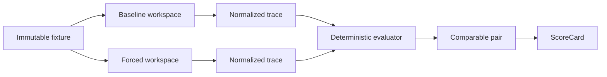

# 把 Skill 当成软件发布：Rook Forge 的考试、审批与回滚

> 发布日期：2026-07-24  
> 项目版本：Rook v0.2.2  
> 阅读时间：约 8 分钟

Coding Agent 的 Skill 很像一段“会影响模型决策的代码”。它可能让 Agent
更稳定，也可能引入错误路由、秘密泄漏、回归或额外成本。然而很多 Skill
系统只有“编写—安装—使用”三步，缺少可重复的效果验证和发布治理。

Rook Forge 的核心选择是：**不要把 Skill 当提示词文件，而要把它当成需要
考试、审批、部署、观测和回滚的软件版本。**

## 1. 问题不是“能不能加载”，而是“是否值得上线”

只验证 `SKILL.md` 能被读取，最多证明格式正确。真正的上线问题至少包括：

- 没有 Skill 时，Agent 能否完成同一任务？
- 强制加载 Skill 后，成功率、时延和 Token 是否改善？
- 让路由器自行决定是否加载时，是否会误触发？
- Direct/Transfer 提升的同时，Regression/Adversarial 是否退化？
- 评测失败是 Skill 失败，还是 Adapter、沙箱、网络或 evaluator 失败？
- 新版本上线后被手工修改，系统能否检测并安全回滚？

因此 Rook Forge 把“效果证据”和“发布权限”拆成两个平面。

## 2. 数据面：隔离配对实验

每个案例在独立工作区中执行 Baseline、Forced Skill 或 Routed Skill。
同一配对共享初始内容，但不共享执行目录和副作用。A/B 顺序按 repetition
交替，pair id 由 suite、case、target、repetition 和 treatment family
稳定生成，避免顺序偏差和结果错配。



Evaluator 不依赖模型“自评”。命令、文件状态、SHA-256、轨迹约束和单层组合
检查均由确定性逻辑完成；可选 LLM Judge 默认关闭，Provider 故障只记
基础设施错误，不能伪装成 Skill 失败。

## 3. 证据面：失败也必须有明确归属

真实 Codex 评测最难的部分不是发起模型调用，而是建立可信边界。Windows
沙箱、工作目录转义、WebSocket 重连、主机睡眠、受限 PowerShell 和写入后
辅助断言都曾造成不完整轨迹。

Rook 的处理原则是：

1. JSONL 严格解析，重复 key 和异常流事件不被“宽容修复”；
2. 轨迹不完整或基础设施排除超过政策阈值时 fail closed；
3. partial run 不拼接、不续跑、不包装成 Formal；
4. 每次 Adapter 身份变化先通过独立 2-call readiness；
5. 必需写入和辅助验证分离，最终工作区由隐藏 evaluator 判定。

Adapter v9 readiness 在之前失败的 application case 上完成 2/2 终态调用，
轨迹完整度 100%，基础设施排除 0。这只证明执行边界就绪；一个配对不足以
估计 Skill 效果，所以门禁仍正确保持 `quarantined`。完整事故与修复记录见
[Codex Formal hardening timeline](../incidents/CODEX_FORMAL_HARDENING.md)。

## 4. 控制面：门禁通过不等于上线

Rook Forge 将自动门禁、人工审批和发布记录建模为三类不可变事实：

- `PromotionDecision`：自动判断 promoted/rejected/quarantined；
- `ApprovalRecord`：审批人、理由、决策 id、版本及全部证据指纹；
- `ReleaseRecord`：目标、前后版本、内容哈希、位置和执行结果。

即使自动门禁 `promoted`，Candidate 仍不可被运行时发现。审批时重新验证
Agent、模型、Adapter、Normalizer、Suite、Policy 和内容哈希；安全失败、
秘密泄漏、新增回归或 stale 不能被人工绕过。

Rook 与 Codex 独立审批。Rook 运行时读取 Registry 中真正部署的指针；
Codex 只部署到当前仓库 `.agents/skills/<name>`，并写入所有权 manifest。
事务使用同级 staging、备份和 journal，非 Rook 管理目录拒绝覆盖。

## 5. 一次真实本地治理生命周期

版本化 dogfood 记录实际执行了本地 Registry 和文件系统事务：

1. v1、v2 分别通过确定性考试；
2. 自动门禁通过后保持 inactive；
3. 四次人工审批分别授权 Rook/Codex 的 v1/v2；
4. 四次部署记录完成双目标替换；
5. 手工篡改 Codex `SKILL.md` 后状态变为 `drifted`；
6. 恢复精确受管内容后重新变为 `active`；
7. 两次事务回滚把 Rook/Codex 都恢复到已审批 v1。

这是真实控制面和文件系统行为，但考试 Agent 是 Fake Agent，因此不能用来
声称真实模型效果。脱敏 id、内容哈希和最终制品哈希见
[`forge-lifecycle-2026-07-24.json`](../evidence/forge-lifecycle-2026-07-24.json)。

## 6. 防止只对一套题过拟合

除 RM-2 差异化套件外，项目新增了两个完全不同的真实仓库 holdout：

- GitHub Actions CI guard：对真实 Rook workflow 做最小权限和超时加固，
  同时用 Regression 案例保护 Dependabot；
- RAG evidence reporter：比较真实检索评测摘要，并用 Adversarial 案例确保
  skipped Ragas 不会被写成 0 分或成功。

两个 suite 都锁定公开仓库 commit、Git blob、Candidate SHA-256、网络策略
和隐藏 validator。目前它们只完成确定性边界验证，仍处于 quarantined，
没有冒充 live model 结果。详见
[Real-repository Skill holdouts](../REAL_REPO_HOLDOUTS.md)。

## 7. 当前数据该怎么读

| 证据 | 结果 | 可以证明什么 |
| --- | --- | --- |
| 跨平台离线 CI | Linux 1753 passed / 7 skipped；Windows 1754 passed / 6 skipped | 工程基线与安全路径可重复 |
| 24-call Pilot | 12/12 可比配对；Baseline 25%，Forced 100%；时延 -22.7%；Token -12.9% | 真实模型上观测到正向 Pilot 信号 |
| Adapter v11 readiness | 此前 profile 失败边界上 2/2 终态；轨迹 100%；基础设施排除 0 | 当前 Adapter 执行边界就绪 |
| 本地治理 dogfood | 审批、双目标部署、漂移检测、恢复、双回滚 | 控制面确实执行了真实事务 |
| Adapter v11 72-call Formal | 72/72 次、36 个配对；Baseline 25% → Forced 100%（+75pp）；中位时延 -16.7%；中位 Token -19.5%；新增回归和基础设施排除均为 0 | 最终成功率、时延和 Token 指标可用于简历；美元成本和路由仍未观测 |

Pilot 数据有价值，但它不是 Formal。项目没有把历史 partial run 或 Fake
Agent 数据包装成结果，而是修复证据边界后从零完成 Formal。对 Agent EvalOps
来说，这种证据纪律本身就是产品能力。

## 8. 三分钟复现

安装发布版：

```powershell
pipx install "git+https://github.com/ZHUMUJUN/Rook.git@v0.2.2"
```

运行零成本完整治理链路：

```powershell
rook eval demo
```

检查两个真实仓库 holdout：

```powershell
python -m pytest tests/test_evalops_real_repo_holdouts.py -q
```

项目首页的 [2–3 分钟演示视频](../video/rook-forge-demo.mp4)
展示了同一条 Candidate → Gate → Approval → Deploy → Drift → Rollback
链路。真实 Formal 会在另一次明确授权的 72-call 运行完成后单独发布。
